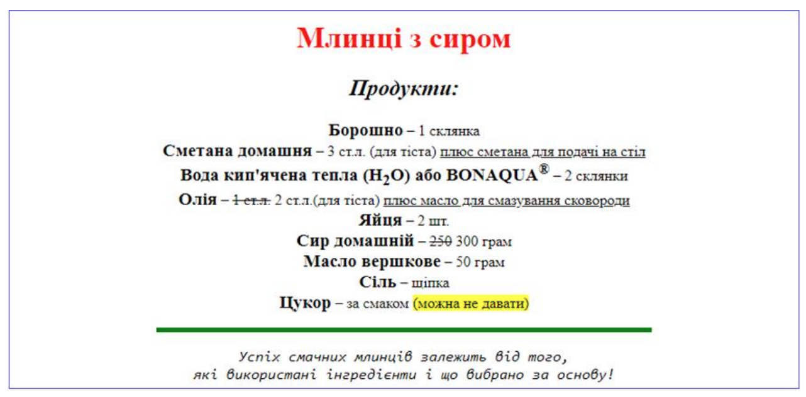
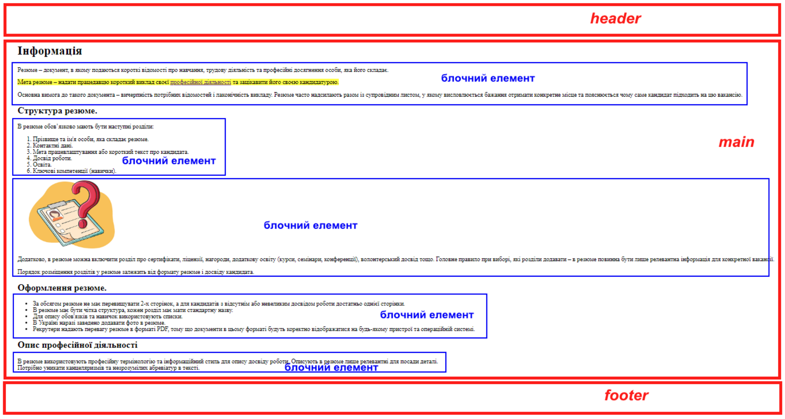
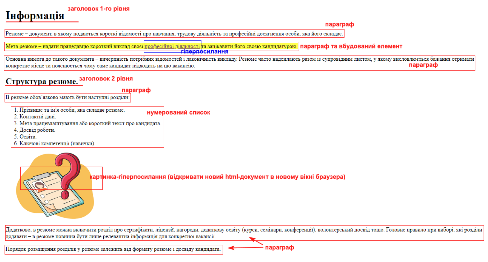
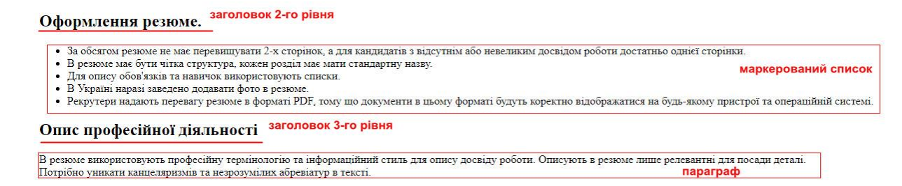
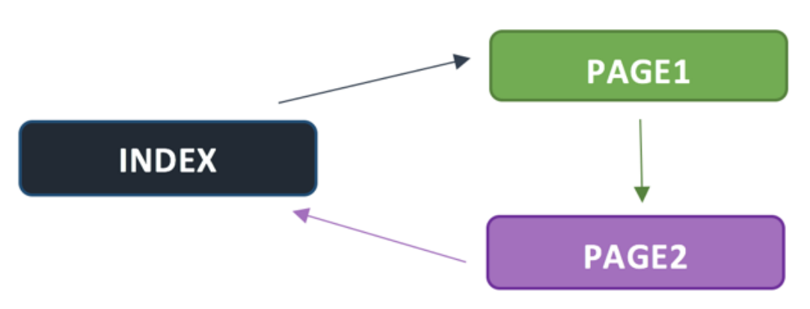

= Лабораторна робота №2

*Тема:* Ознайомлення з мовою HTML.
Семантична розмітка документів за стандартом HTML5.

*Мета:* ознайомитися з основами мови HTML, вивчити структуру HTML-документа, навчитися використовувати парні та непарні теги для створення початкової розмітки веб-сторінки, а також налаштувати та використовувати інтегроване середовище розробки (IDE) для роботи з HTML-кодом.

== Теоретична частина

*Найпростіший HTML-документ має вигляд:*

[source,html]
----
<!DOCTYPE html>
<html lang="en">
<head>
    <title></title>
</head>
<body>
…
</body>
</html>
----

[disc]
* Оголошення <!DOCTYPE html> визначає цей документ як HTML5.
* Тег <html> є кореневим елементом HTML-сторінки, визначає початок HTML-файлу, всередині нього зберігається заголовок (<head>) і тіло документа (<body>).
* Тег <head> містить мета-інформацію про HTML-документ, але вміст тегу не показується безпосередньо на сторінці, за винятком контейнера <title>.
У ньому можуть міститися такі теги як title, meta, style, script.
Порядок слідування цих елементів не має значення.
* Метатеги − це теги, за допомогою яких можна передати деяку інформацію про сторінку пошуковим системам або браузеру.
За допомогою метатегів можна змінювати кодування сторінки, опис документу, додавати ключові слова, автора та інше.
* Тег <title> визначає назву веб-сторінки.
Даний тег є обов’язковим. <title>My page</ title>
* Тег <body> відображає видимий зміст HTML-сторінки.

HTML-документ являє собою звичайний текстовий файл, розмічений за допомогою тегів.
Тег - це елемент синтаксису, який використовується для розмітки початку або кінця елемента в коді.
Це суто текстовий маркер у коді, за допомогою якого браузер розуміє, де цей елемент починається і де закінчується.

*Теги бувають двох типів:*

* контейнерні (парні), які можуть містити в собі текст та інші теги;
* порожні теги (одиночні).

За стандартом мови HTML закривати необхідно усі теги.
Якщо тег контейнерний (парний), то його необхідно закривати наступним чином:

[source,html]
----
<h2><em>Заголовок</em></h2>
----

Якщо тег порожній (одиночний), то його потрібно закривати наступним чином:

[source,html]
----

----

*Контейнерні теги*

[start=1]
. *Теги, що задають фізичний стиль тексту (як він виглядає):*

[disc]
* <b> Жирний </b>
* <i> Курсив </i>
* <u> Підкреслений </u>
* <s> Перекреслений </s>
*  Нижній індекс 
*  Верхній індекс 
* <small> Розмір шрифту, на одиницю менше основного</small>
* <big>Розмір шрифту, на одиницю більший за основний </big>
*  Встановлений шрифт  – надає можливості управління гарнітурою (сімейство шрифту), розміром і кольором тексту.

Синтаксис:

[source,html]
----
Текст
----

*Атрибути тегу font:*

[disc]
* зміна гарнітури тексту виконується простим додаванням до тегу  атрибута face.
* задавання розміру поточного шрифту в окремих місцях тексту в діапазоні від 1 до 7 виконується простим додаванням до тегу  атрибута size.
* для зміни кольору шрифту використовують в тезі  атрибут color, де в якості значення атрибута підставляють англійську назву кольору або його шістнадцяткове представлення.
При заданні кольору шістнадцятковим числом необхідно представити цей колір розкладеним на три складові:
червону (R – Red), зелену (G – Green), синю (B – Blue), кожна з яких має значення від 00 до FF.
У цьому випадку ми маємо справу з так званим форматом RGB.

Ці теги можуть бути вкладеними один в одного довільну кількість разів.

[start=2]
. *Теги, що задають логічний стиль тексту (що він собою представляє):*

[disc]
* <h1> Текст 1 </h1> … <h6> Тема 6 </h6> ● 
 Абзац тексту 
 Теги <h1>…</h1>−<h6>…</h6>, 
...
 не можуть бути вкладеними один в одного, але можуть містити в собі теги фізичного стилю.
У цих тегів є атрибут «align», який задає вирівнювання заголовка по лівому, правому краю, середині та по ширині (left, center, right, justify).
* <em> виділений текст </em> − відображається курсивом.
* <strong> сильно виділений текст </strong> − відображається жирним.
* <cite> цитата </cite> − відображається курсивом.
* <blockquote> довга цитата </blockquote> – фрагмент тексту, що відображається з відступами зліва, справа зверху і знизу.
* <code> програмний код </code> – відображається моноширинним.
* <dfn> термін </dfn> – визначення терміну, відображається курсивом.
* <samp> приклад програмного коду </samp> − відображається моноширинним.
* <kbd> комбінація клавіш </kbd> – відображається моноширинним і жирним.
* <var> назва або значення змінної </var> − відображається курсивом.
* <acronym> акронім </acronym> − відображається курсивом.
* <del> виділений фрагмент тексту </del> − відображається перекресленим.
* <ins> доданий фрагмент тексту </ins> − відображається підкресленим.

*Одиночні теги*

*   − перехід на наступний рядок.
* 
 − додає горизонтальну лінію та має наступні атрибути:
* align − визначає вирівнювання лінії (center | left | right).
* color − колір лінії.
* noshade="noshade" − малює лінію без тривимірних ефектів.
* size − товщина лінії (в пікселях, за замовчуванням – 2).
* width − ширина лінії (в пікселях або відсотках).
*  − додає на веб-сторінку малюнок.

*Синтаксис:*

[source,html]
----

----

Він має два обов’язкових атрибути:

* src − абсолютна або відносна адреса, що задає місцезнаходження зображення;
* alt − альтернативний текст (відображається в разі, якщо в браузері вимкнено відображення картинок)

*Гіперпосилання*

Гіперпосилання в мові HTML створюються за допомогою контейнерного тегу <a.> В браузерах текст посилання зазвичай відображається з підкресленням.

*Синтаксис:*

[source,html]
----
<a href="гіперпосилання"> Текст посилання </a>
----

*Атрибути:*

title − спливаюча підказка (з’являється при наведенні курсору миші на посилання); target − вказує, куди необхідно відкрити документ, на який вказує посилання.

Щоб картинка була посиланням на сайт або веб-сторінку, елемент  досить вставити всередину посилання <a> наступним чином:

[source,html]
----

----

Тут атрибут src визначає адресу картинки (image – назва директорії в якій знаходиться рисунок, shark.jpg – назва рисунку із його розширенням), а href – адресу сайту або веб-сторінки, куди буде вести посилання, title − спливаюча підказка (з’являється при наведенні курсору миші на посилання); target − вказує браузеру, де саме відкривати посилання — у тій самій вкладці (дефолтна поведінка) чи в новій (_blank).

== Практична частина

. В обраному редакторі коду (на вибір студента) створити новий проєкт.
. Всі зображення, які необхідні для завдань, знаходяться в директорії assets

== Завдання 1.

. Створити новий файл html файл у проєкт.
Розмітити текст за допомогою вивчених тегів відповідно до зразка:

== Завдання 2.

Створити новий html файл у проєкті.
Реалізувати html-сторінку згідно заданої структури.

Структура html-сторінки:

В шапці (тег header) відобразити:

* Логотип (довільний рисунок) розміром не більше 100 на 100.
* Заголовок 1-го рівня із текстом: «Семантична розмітка документів за стандартом HTML5».

Контентну частину (тег main) реалізувати згідно зразка із використанням заданих тегів:

В підвалі (тег footer) відобразити:

* Авторські права із символом копірайта.
* Контактна інформація, яка містить ПІБ студента-виконавця та номер групи.

'''

*Текст html-сторінки:*

Інформація Резюме – документ, в якому подаються короткі відомості про навчання, трудову діяльність та професійні досягнення особи, яка його складає.

Мета резюме – надати працедавцю короткий виклад своєї професійної діяльності та зацікавити його своєю кандидатурою.

Основна вимога до такого документа – вичерпність потрібних відомостей і лаконічність викладу.
Резюме часто надсилають разом із супровідним листом, у якому висловлюється бажання отримати конкретне місце та пояснюється чому саме кандидат підходить на цю вакансію.

Структура резюме.

В резюме обов’язково мають бути наступні розділи:

- Прізвище та ім'я особи, яка складає резюме.
- Контактні дані.
- Мета працевлаштування або короткий текст про кандидата.
- Досвід роботи.
- Освіта.
- Ключові компетенції (навички).

Додатково, в резюме можна включити розділ про сертифікати, ліцензії, нагороди, додаткову освіту (курси, семінари, конференції), волонтерський досвід тощо.

Головне правило при виборі, які розділи додавати – в резюме повинна бути лише релевантна інформація для конкретної вакансії.

Порядок розміщення розділів у резюме залежить від формату резюме і досвіду кандидата.
Оформлення резюме.

- За обсягом резюме не має перевищувати 2-х сторінок, а для кандидатів з відсутнім або невеликим досвідом роботи достатньо однієї сторінки.
- В резюме має бути чітка структура, кожен розділ має мати стандартну назву.
- Для опису обов'язків та навичок використовують списки.
- В Україні наразі заведено додавати фото в резюме.
- Рекрутери надають перевагу резюме в форматі PDF, тому що документи в цьому форматі будуть коректно відображатися на будь-якому пристрої та операційній системі.

Опис професійної діяльності В резюме використовують професійну термінологію та інформаційний стиль для опису досвіду роботи.

Описують в резюме лише релевантні для посади деталі.

Потрібно уникати канцеляризмів та незрозумілих абревіатур в тексті

'''

== Завдання 3.

. Створити три HTML-файли у проєкті, один з яких назвати index.html.
На кожній сторінці додати гіперпосилання з текстом «Перейти далі» за шаблоном:
[disc]
* у файлі index.html на файл page1.html;
* у файлі page1.html на файл page2.html;
* у файлі page2.html на index.html.

. У файл index.html додати рисунок-посилання на пошукову систему Google.

. Додати гіперпосиланя:
[disc]
* у файлі index.html на зображення білочки із папки animals;
* у файлі page1.html на будь-яку картинку з папки nature;
* у файлі page2.html на будь-яку картинку з папки food;

== Контрольні запитання:

. Що таке HTML і яка його основна функція в веб-розробці?
. Яка структура HTML-документа?
. Чим парні теги відрізняються від непарних?
Наведіть приклади.
. Яке значення має тег <!DOCTYPE> в HTML-документі?
. Що таке атрибути тегів і як вони використовуються?
. Як створити заголовок різного рівня (наприклад, <h1>, <h2>) в HTML?
. Які теги використовуються для створення списків (нумерованих та маркованих) в HTML?
. Який тег використовується для створення посилання і як його правильно оформити?
. Як налаштувати інтегроване середовище розробки (IDE) для роботи з HTML-документами?
. Що таке коментарі в HTML і як вони записуються?
