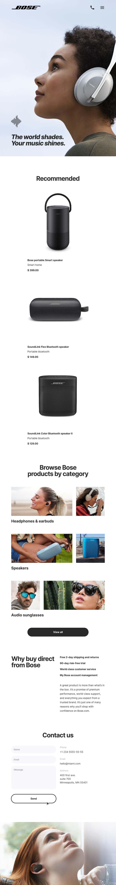

= ЛАБОРАТОРНА РОБОТА №10

*Тема: Препроцесор (шаблонізатор) Pug, препроцесор SCSS/SASS.
Автоматизація процесів верстки.*

*Мета:* навчитися використовувати препроцесор Pug для спрощення та автоматизації роботи з HTML-шаблонами, а також освоїти основи препроцесорів SCSS/SASS для організації та спрощення написання CSS-коду.
Ознайомитися з інструментами автоматизації процесів верстки, для автоматизованої обробки Pug та SCSS/SASS файлів, оптимізації робочого процесу і підвищення ефективності розробки веб-інтерфейсів.

*Вимоги до звіту:*

. Робота повинна бути виконана в окремому git репозиторію.
. Використовувати підхід mobile-first.
. Для автоматизації та компіляції Pug, SCSS/SASS використати https://github.com/Computer-Science-Department-ChNU/vite-pug-scss-template[шаблон vite-pug-scss-template].
. Дотримуватись https://sass-guidelin.es/[SASS Guidelines].
. Для скидання стилів використовувати reset або normalize, який має бути підключений в основний файл main.scss.
. Робота повинна бути виконана без javaScript.
. Результати завдань лабораторної роботи повинні бути завантажені до особистого репозиторію студента.

== Самостійна робота:

** https://vite.dev/guide/[Vite Documentation]
** https://pugjs.org/api/getting-started.html[Pug Documentation]
** https://sass-lang.com/documentation/[SASS Documentation]
** https://sass-guidelin.es/[SASS Guidelines Documentation]

== Практична частина

=== Завдання:

==== Завдання 7 балів:

. Налаштувати середовище для роботи з Pug та SASS.
. Використовуючи код HTML лабораторної роботи 8 (завдання 4 та 5), переписати з використанням Pug.
.. Створити базовий шаблон;
.. Використати Template Inheritance;
.. Розбити сторінку на блоки (logo.pug, navigation.pug, header.pug, footer.pug і т.д.);
.. Використати змінні (Variables) та Interpolation;
.. Використати цикли та умови;
.. Використати Mixins з передачею даних;
. Використовуючи CSS код лабораторної роботи 8 (завдання 4 та 5), переписати з використанням синтаксису SASS або SCSS.
. Використати вкладеності та основні можливості препроцесора SASS:
.. Селектор батька «&»;
.. Наслідування іменування;
.. Використати змінні (Variables);
.. Використати Mixins;
.. Використати функції та оператори;
.. Розбити код на логічні модулі;

==== Завдання 10 балів:

. Зверстати вебсторінку з використанням Pug та SASS.
. https://drive.google.com/file/d/1kt35lQUysOkgnIbqb1cjACyT96RlaWG8/view?usp=sharing[Макети сторінки для figma].

==== Превью сторінок:

Mobile (320):

Tablet (744):

Desktop (1260):

. Налаштувати середовище для роботи з Pug та SASS.
. Використовуючи Pug:
.. Створити базовий шаблон;
.. Використати Template Inheritance;
.. Розбити сторінку на блоки (logo.pug, navigation.pug, header.pug, footer.pug і т.д.);
.. Використати змінні (Variables) та Interpolation;
.. Використати цикли та умови;
.. Використати Mixins з передачею даних;
. Використати препроцесор SASS.
. Використати вкладеності та основні можливості препроцесора SASS:
.. Селектор батька «&»;
.. Наслідування іменування;
.. Використати змінні (Variables);
.. Використати Mixins;
.. Використати функції та оператори;
.. Розбити код на логічні модулі;

== Контрольні запитання:

. Що таке препроцесор (шаблонізатор) Pug, які його переваги у створенні HTML-шаблонів?
. Які основні синтаксичні відмінності між Pug та стандартним HTML?
. Що таке препроцесор SASS, чим він відрізняється від звичайного CSS?
. Які основні переваги використання препроцесора SASS?
. Як створюються змінні в SCSS/SASS, і як їх можна використовувати для оптимізації стилів?
. Що таке міксіни в SCSS/SASS, і як їх застосовувати для повторного використання коду?
. Як працює вкладеність у SCSS/SASS, і які її переваги для організації коду?
. Які інструменти автоматизації процесів верстки використовуються для роботи з Pug та SCSS/SASS?
. Як налаштувати Gulp або Webpack для автоматичної обробки файлів Pug та SCSS/SASS?
. Які переваги надає автоматизація процесів верстки при роботі над великими проєктами?
