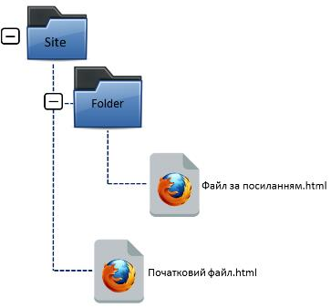
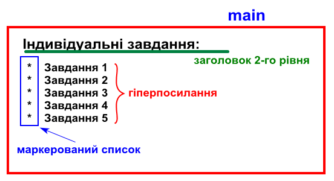
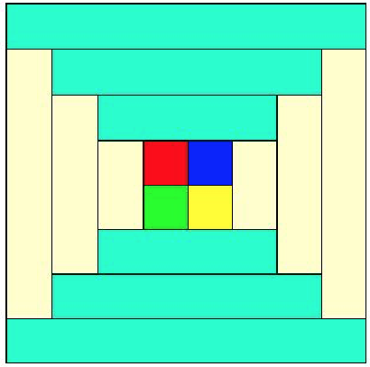
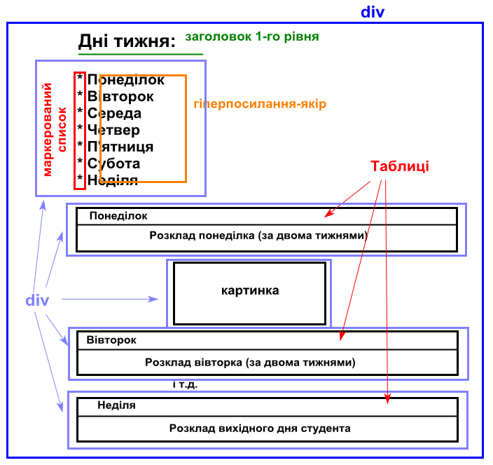

= Лабораторна робота №3

*Тема: Основні теги HTML*

*Мета:* ознайомитися з основними тегами мови розмітки HTML та навчитися застосовувати їх для створення структурованих html-сторінок.
Використання базових тегів для форматування тексту, створення гіперпосилань, списків, таблиць, зображень та форм.
Реалізація семантичної розмітки для поліпшення доступності та SEO-оптимізації веб-ресурсів.

*Вимоги до звіту:* результати завдань лабораторної роботи повинні бути завантажені до особистого репозиторію студента.

== Практична частина

В обраній IDE або редакторі коду (на вибір студента) створити новий проєкт.

Організувати систему файлів та директорій, згідно з наведеним рисунком, на якому верхній рівень – це директорія для цілого проєкту лабораторної роботи, в якій міститься:

* index.html – робочий файл проєкту (головна сторінка сайту);
* директорія img – для збереження картинок та іконок;
* директорія audio – для збереження аудіо-файлів;
* директорія project_parts – для збереження html-сторінок кожного завдання лабораторної роботи.

*Структура index.html:*

[source,HTML]
----
<!doctype html>
<html lang="uk">
<head>
  <meta charset="UTF-8">
  <meta name="viewport"
        content="width=device-width, user-scalable=no, initial-scale=1.0, maximum-scale=1.0, minimum-scale=1.0">
  <meta http-equiv="X-UA-Compatible" content="ie=edge">
  <title>Web technologies practice: basic HTML tags</title>
</head>
<body>
  <header></header>
  <main></main>
  <footer></footer>
</body>
</html>
----

* В шапці (тег `header`) відобразити Заголовок 1-го рівня із текстом «Web technologies practice: basic HTML tags», вирівнювання тексту по центру.
* Контентну частину (тег `main`) реалізувати згідно зразка із використанням заданих тегів:
. кожне посилання – це html-сторінка відповідного індивідуального завдання лабораторної роботи.
. кожне завдання відкривати в новому вікні браузера.
. кегель гіперпосилань – 16px.

*Структура html-сторінок індивідуальних завдань:*

* Кожен елемент індивідуального завдання повинен бути розташований по центру вікна браузера.
* На кожній html-сторінці додати гіперпосилання з текстом «Повернутись на головну».

== Завдання

=== Завдання №1

Створити файл table.html, в якому реалізувати:

. Таблицю, згідно зразка Рамки таблиці завтовшки 2px, колір комірок на вибір студента.
+

. Необхідно зверстати картину Піта Мондріана «Композиція з червоним, синім і жовтим», використовуючи таблицю.
+
image::4.png[]
+
Кольори, що використовуються в картині:
+
[source,HTML]
----
#fffa69 - жовтий,
#074481 - синій,
#ff5b2d - червоний,
#000000 - чорний,
#ffffff- білий
----
+
Пропорції картини та комірок можна не зберігати.
Важливе об'єднання комірок та їхнє розфарбування.

=== Завдання №2

Створити файл schedule.html:

* передбачити маркований список із днів тижня;
* кожен елемент списку – це посилання-якір на розділ поточної веб-сторінки, де розділами виступають таблиці навчального розкладу студента (за двома тижнями) для кожного робочого дня тижня та таблиці розкладу вільного часу кожного вихідного дня тижня;
* всі елементи на сторінці, окрім заголовку, повинні бути поміщенні в блочний елемент `div`;
* після кожного блочного елементу, який буде містити таблицю, необхідно додати блочний елемент, який буде містити рисунок (на вибір студента) розміром 400 на 400 пікселів;
* розфарбувати таблиці на власний розсуд;
* батьківський блочний елемент повинен бути розташований по центру вікна браузера.

=== Завдання №3

Створити файл questionnaire.html і реалізувати форму анкети, структуру якої студент формує самостійно, яка буде збирати інформацію від користувача.

Форму реалізувати таким чином, щоби були продемонстровані наступні можливості HTML5:

* текстові поля `input type="text"`;
* текстова область `textarea`;
* поле паролю `input type="password"`;
* поле email `input type="email"`;
* поле мобільного номера `input type="tel"`;
* поле дати `input type="date"`;
* не менше двох блоків radio-buttons input `type="radio"` по три значення в кожному з блоків, передбачивши застосування для одного з значень другого блоку активність за замовчуванням (атрибут `checked`);
* блок check-buttons `input type="checkbox"` із чотирма значеннями;
* випадний список (теги `select` + `option`) із п’ятьма значеннями, в якого третє значення визначене за замовчуванням (атрибут `selected`);
* випадний список із шістьма значеннями з можливістю множинного вибору (атрибут `multiple`);
* випадний список з чотирма групами пунктів по три значення в кожній групі (тег `optgroup`);
* випадний список із підказками (тег `datalist`);
* кнопки `type="submit"` та `type="reset"`;
* кнопку завантаження файлів `input type="file"` – з умовою завантаження тільки аудіо-файлів і більше ніж одного файлу (атрибути `accept` + `multiple`);
* продемонструвати структуру запиту, який буде сформовано формою, після натиснення на `button` `type="submit"`, в полі url-адресу поточної html-сторінки через атрибут `method="get"` та `method="post"` + `enctype="multipart/form-data"`.

*Додаткові умови:*

* до усіх полів додати підписи за допомогою тегу `label`;
* згрупувати елементи форми за тематичними блоками за допомогою тегів `fieldset` і `legend`;
* додати пояснення (підказки) до усіх полів, які підтримують атрибут `placeholder`;
* частину полів зробити обов’язковими для заповнення (атрибут `required`);
* для поля `email` відключити автозаповнення за допомогою атрибуту `autocomplete="off"`;
* для полів `email` та `tel` використати атрибут `pattern` і задати регулярні вирази для перевірки коректності цих полів;
* для поля `password` використати атрибут `pattern` і задати регулярний вираз перевірки пароля за параметрами:
** складається з 6 символів;
** містить хоча б одну велику літеру;
** містить хоча б одну малу літеру;
** містить хоча б одну цифру;
* врахувати можливість інтерактивного переходу між елементами форми через клавішу `TAB` (атрибут `tabindex`);
* для кожного елемента форми застосувати пару атрибутів `name` + `value`, щоб обробник форми міг ідентифікувати ім’я елемента (`name`), яке відправляється разом з вхідними даними (`value`) на сервер.

=== Завдання №4

Створити файл map.html.
Знайти в мережі Інтернет карту України і розмістити у створеному файлі дане зображення.
Зображення помістити в блочний елемент.

За допомогою онлайн-сервісу для створення карт зображень (https://www.image-map.net/[Image Map Generator]) визначити координати областей та прив’язати до кожної області посилання на сторінку відповідної області у Вікіпедії.

=== Контрольні запитання:

. Що таке HTML і яку роль він відіграє у створенні веб-сторінок?
. Яка структура базового HTML-документа?
Назвіть обов'язкові елементи.
. Який тег використовується для створення гіперпосилання?
Як можна налаштувати відкриття посилання в новій вкладці?
. Які теги використовуються для створення заголовків на веб-сторінці?
Скільки рівнів заголовків існує в HTML?
. Чим відрізняються теги `<ul>` і `<ol>`?
Для чого вони використовуються?
. Які атрибути використовуються для встановлення зображень на веб-сторінці, і як правильно задавати розміри зображень?
. Як створити таблицю в HTML?
Назвіть теги, які для цього використовуються.
. Який тег застосовується для виділення абзаців тексту на сторінці?
. Як створити форму для введення даних користувачем?
Назвіть основні теги та атрибути, що використовуються у формах.
. Що таке семантична розмітка в HTML, і чому вона важлива для доступності та SEO?
Наведіть приклади семантичних тегів.

