= Лабораторна робота №4

*Тема: CSS властивості шрифту та тексту.
Застосування селекторів*

*Мета*: вивчити основні властивості CSS, пов'язані з форматуванням шрифтів і тексту, а також навчитися застосовувати різні типи CSS-селекторів для створення стилізованих вебсторінок.

*Вимоги до звіту:* результати завдань лабораторної роботи повинні бути завантажені до особистого репозиторію студента.

== Теоретичний матеріал

CSS властивості шрифту та тексту:

*1) font-family*

Встановлює сімейство шрифту, який буде використовуватись для оформлення тексту вмісту html-сторінки.
За замовчуванням, використовується сімейство шрифту Times New Roman.

Важливо, що всі властивості шрифту та тексту успадковується, тому найбільш часто використовуваний в дизайні шрифт, приписується відразу для тегу body, іншими словами, сімейство шрифту буде застосовне до всіх тегів контенту html-сторінки.

Список шрифтів може включати одну або декілька назв розділених комою.
Якщо у назві є пробіли, то дана назва повинна включатись або в одинарні або подвійні лапки.

Закінчують список ключовим словом (sans-serif), який описує тип шрифту.

Типи шрифтів:

* serif – шрифти із засічками (антиквенні), типу Times;
* sans-serif – рубані шрифти (шрифти без засічок або гротески), типовий представник – Arial;
* cursive – курсивні шрифти;  fantasy – декоративні шрифти;
* monospace – моноширинні шрифти, ширина кожного символу у такому сімействі однакова (шрифт Courier).

Приклад коду CSS:

Для тегу із класом .arial задамо наступне сімейство шрифтів.

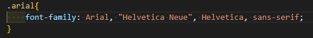

*2) font-size*

Визначає розмір шрифту елемента (кегель).

Приклад коду CSS:

Для тегу із класом .size задамо наступний розмір шрифту.

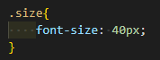

*3) font-style*

Визначає зображення шрифту – звичайне, курсивне або похиле.

* normal – звичайне зображення тексту.
* italic – курсивне зображення.
* oblique – похиле накреслення.

Курсив і похилий шрифт, при всій їхній схожості, не одне й те саме.
Курсив – це спеціальний шрифт, що імітує рукописний, похилий утворюється шляхом нахилу звичайних знаків вправо.

Приклад коду CSS:

Для тегів із класами .italic та .oblique задамо наступні правила.

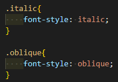

*4) font-weight*

Встановлює насиченість шрифту (вагу шрифту).
Значення насиченості шрифту можна задавати як цифрами так і словами.

* 100 – thin (тонкий)
* 300 – lite (лайт)
* 400 – normal (нормальний)
* 500 – medium (середній)
* 600 – semibold (напівжирний)
* 700 – bold (жирний)
* 900 – black (чорний)

Приклад коду CSS:

Для тегів із вказаними класами задамо наступні правила.

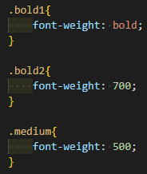

*5) color*

Визначає колір тексту.
Для завдання кольорів зазвичай використовуються числа у шістнадцятковому коді, або за допомогою RGB.
Тому, що відтінків кожного кольору є дуже багато, і знати їхні найменування ми не можемо.
Детально про кольори можна переглянути у файлі «Списки кольорів».

Приклад коду CSS:

Для тегу із вказаним класом задамо наступні правила.

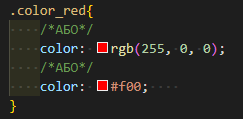

*6) text-align*

Визначає горизонтальне вирівнювання тексту у межах елемента:

* center – вирівнювання тексту центром.
* justify – вирівнювання по ширині, що означає одночасне вирівнювання по лівому та правому краю.
Щоб зробити це, браузер в цьому випадку додає пробіли між словами, щоби наш текст займав всю ширину простору (в даному випадку, всю ширину вікна браузера).
* left – вирівнювання тексту з лівого краю.
* right – вирівнювання тексту з правого краю.

Приклад коду CSS:

Для тегів із вказаними класами задамо наступні правила.

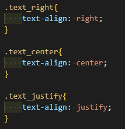

*7) text-decoration*

Додає оформлення тексту, таке як його підкреслення, перекреслення, лінії над текстом.
Одночасно можна застосувати більше одного стилю, перераховуючи значення через пробіл.
Ця властивість успадковується і може набувати значення:

* line-through – створює перекреслений текст.
* overline – лінія проходить над текстом.
* underline – встановлює підкреслений текст.
* none – скасовує всі ефекти, у тому числі і підкреслення у посилань, яке задано за замовчуванням.

Приклад коду CSS:

Для тегу із вказаним класом задамо наступні правила.

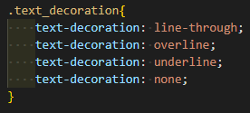

*8) text-shadow*

Додає тінь до тексту.

Синтаксис:
text-shadow: горизонтальне_зміщення вертикальне_зміщення розмір_розмиття_тіні колір;

Наприклад: text-shadow: 1px 1px 1px #000; – тінь зсунута на 1рх вліво, на 1рх вниз, розмір розмиття тіні = 1рх, колір тіні – чорний.

Приклад коду CSS:

Для тегу із вказаним класом задамо наступні правила.

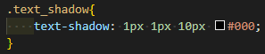

*9) text-transform*

Керує перетворенням тексту на великі або малі символи:

* capitalize – перший символ кожного слова в реченні буде великим.
Інші символи свого вигляду не змінюють.
* lowercase – усі символи тексту стають малими (нижній регістр).
* uppercase – усі символи тексту стають великими (верхній регістр).
* none – не змінює регістр символів.

Приклад коду CSS:

Для тегу із вказаним класом задамо наступні правила.

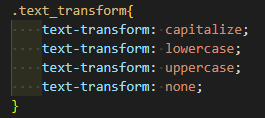

*10) text-indent*

Встановлює величину відступу першого рядка текстового блоку.
Застосовується тоді, коли нам потрібно створити щось типу «червоного рядка», рядка на який користувач повинен звернути увагу, або коли нам просто необхідно додати абзацний відступ.

Приклад коду CSS:

Для тегу із вказаним класом задамо наступні правила.

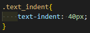

*11) letter-spacing*

Визначає інтервал між символами (літерами).
Використовується, коли потрібно розтягнути текст.

Приклад коду CSS:

Для тегу із вказаним класом задамо наступні правила.

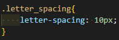

*12) word-spacing*

Встановлює проміжок (інтервал) між словами.

Приклад коду CSS:

Для тегу із вказаним класом задамо наступні правила.

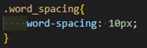

*13) white-space*

Керує властивостями пробілів між словами. Застосовується в основному зі значенням
nowrap, яке забороняє перенесення рядка. Таким чином, весь текст відображається в один
рядок і не «ламається». Значення normal поверне все, як було.

Приклад коду CSS:

Для тегу із вказаним класом задамо наступні правила.

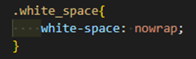

*14) line-height*

Встановлює міжрядковий інтервал тексту. Широко застосовується під час верстки тексту.

Приклад коду CSS:

Для тегу із вказаним класом задамо наступні правила.

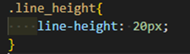

*15) background-color*

Визначає колір фону для елемента. Колір фону можна задавати або записом за допомогою універсальної властивості background або окремим записом саме для кольору.

Є декілька варіантів запису значень, як задають колір фону

- За замовчуванням блок є прозорим, тобто немає кольору.

Приклад коду CSS:

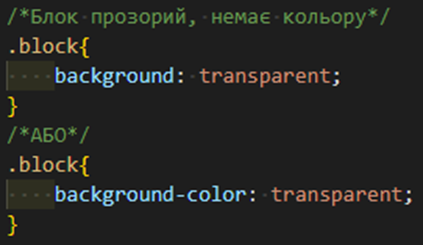

- Задати колір через його шістнадцяткове представлення.

Приклад коду CSS:

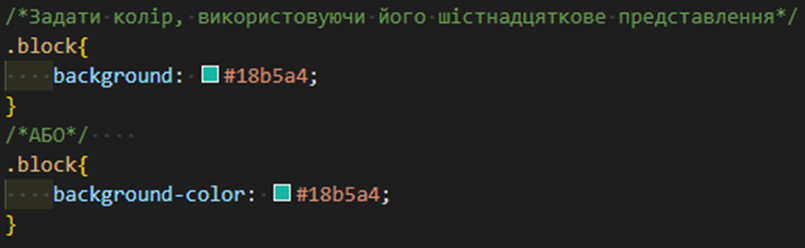

- Задати колір через його RGB-представлення.

Для того, щоби перетворити шістнадцятковий код кольору у його RGB або RGBA представлення, можна користуватись Кодувальниками з HEX в RGB/RGBA.

RGB-формат – це сукупність трьох кольорів red, green, blue, які в перемішці дають нам відповідний колір.

Приклад коду CSS:

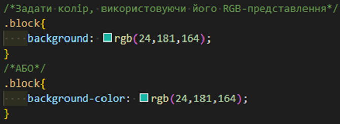

- Задати колір через його RGB-представлення з альфа-каналом, що дозволить зробити колір фону напівпрозорим.

RGB-формат з альфа-каналом – це сукупність трьох кольорів red, green, blue, які в перемішці дають нам відповідний колір, плюс, 4 параметр, який задає прозорість.

Приклад коду CSS:

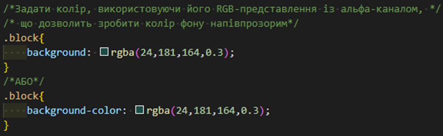

*16) list-style*

Це набір властивостей, які відповідають за оформлення списків.

- list-style-type (тип маркера списку) – властивість змінює тип маркера або видаляє маркер для маркованого та нумерованого списків.

Деякі із значень властивості.

. disc – значення за замовчуванням, як маркер елементів списку виступає зафарбований кружок.
. circle – як маркер виступає не зафарбований кружок.
. decimal – 1, 2, 3, 4, 5, …
. decimal-leading-zero – 01, 02, 03, 04, 05, …
. lower-latin – a, b, c, d, e, …
. lower-roman – i, ii, iii, iv, v, …
. none – маркер відсутній.
. square – як маркер виступає зафарбований або не зафарбований квадрат.
. upper-latin – A, B, C, D, E, …
. upper-roman – I, II, III, IV, V, …

Приклад коду CSS:

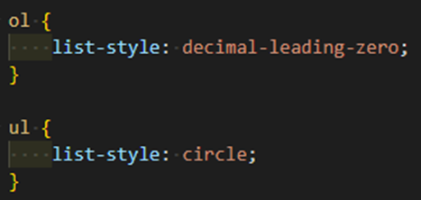

- list-style-image (зображення для списку елементів) – як маркер елементів списку можна використовувати зображення та градієнт заливки.

Значення:

* url(url) – шлях до зображення.
* none – значення за замовчуванням, означає відсутність зображення. Також прибирає зображення для елемента із групи елементів із встановленим зображенням-маркером.

Приклад коду CSS:

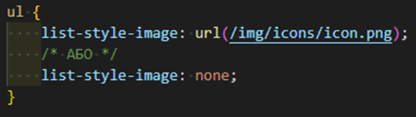

- list-style-position (розташування маркера списку) – надає можливість розташовувати маркер поза або всередині вмісту списку.

Значення:

* outside – значення за замовчуванням, маркер знаходиться поза блоком з текстом.
* outside – значення за замовчуванням, маркер знаходиться поза блоком з текстом.

Приклад коду CSS:

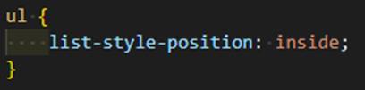

== Практична частина

=== Завдання №1

Створити HTML-файл «lab4_1.html» та таблицю стилів «style.css». У файлі «lab4_1.html» підключити файл «style.css».

. У файл «lab4_1.html» додати 3 абзаци тексту та 2 блочні елементи (div) із текстом-риба (Lorem ipsum) по 50 слів в кожному елементі.
. За допомогою універсального селектора (*) для всього контенту html-сторінки встановити сімейство шрифту Arial, розмір шрифту 20px та інтервал між текстом в 40px.
. Використовуючи селектор тегів задати для всіх абзаців зелений колір тексту та вирівнювання тексту по центру, а для всіх блочних елементів – вирівнювання по ширині.
. Додати до 1-го та 3-го абзаців клас та за допомогою селектору класів змінити колір тексту на червоний.
. Додати до 1-го абзацу клас та за допомогою селектору класів заборонити перенесення рядка аби весь текст відображався в один рядок.
. Додати до другого абзацу ідентифікатор та за допомогою відповідного селектору ідентифікатора текст відобразити курсивом та жирним.
. Додати клас, який до 2-го абзацу та 2-го блочного елементу додає тінь до тексту через селектор класу: горизонтальне зміщення 5px, вертикальне зміщення -5px, розмиття тіні 3px, колір тіні – на вибір студента.
. До 1-го блочного елементу додати клас, який задає наступні стилі через селектор класу:
* перекресленого тексту;
* усі символи тексту перевести у верхній регістр;
* встановити величину відступу першого рядка текстового блоку в 50px;
. До 2-го блочного елементу додати клас, який задає наступні стилі, через селектор класу:
* інтервал між символами в 30px;
* інтервал між словами в 50px;

*Результат 1-го завдання:*

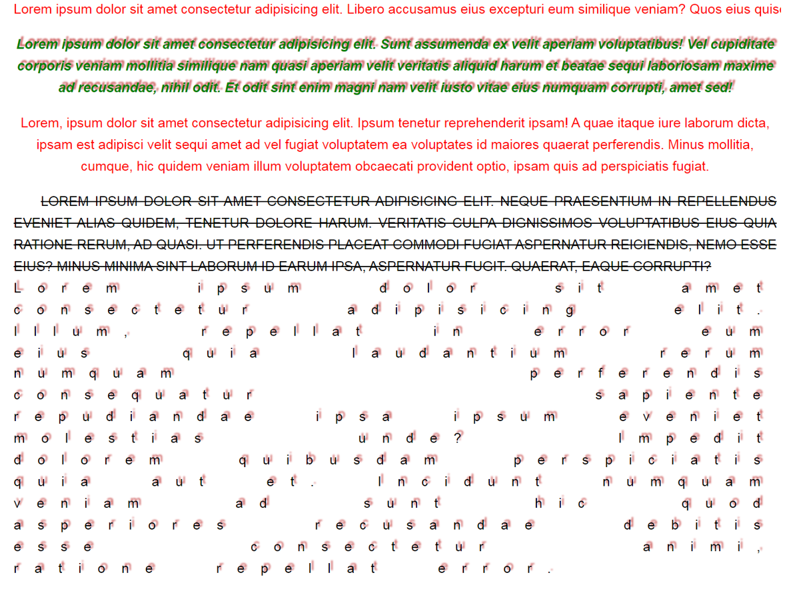

=== Завдання №2

Створити HTML-файл «lab4_2.html» та таблицю стилів «style.css». У файлі «lab4_2.html» підключити файл «style.css».

За допомогою основних CSS властивостей шрифту та тексту відформатувати текст із завдання 1 (Лабораторна робота 2) через використання селекторів тегів, класів та ідентифікатора.

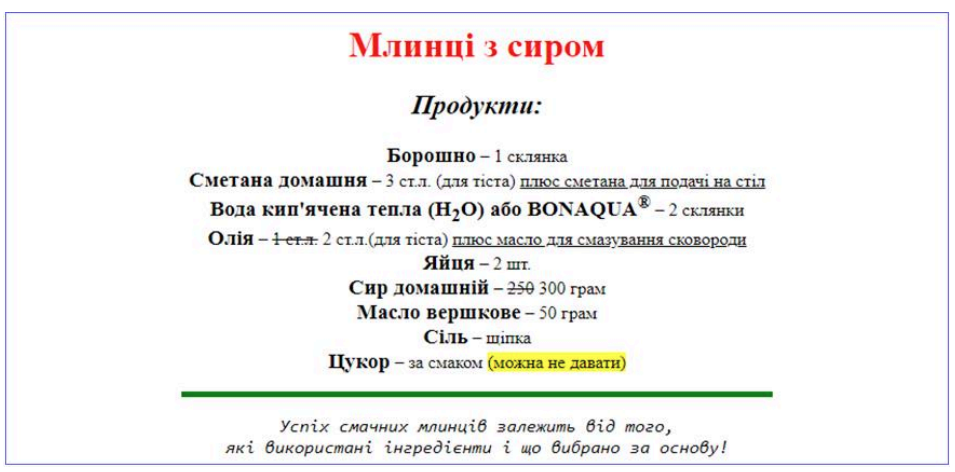

=== Завдання №3

Створити HTML-файл «lab4_3.html» та таблицю стилів «style.css». У файлі «lab4_3.html» підключити файл «style.css».

Створити багаторівневе меню (використати маркований список та тег для додавання посилань – кожен елемент списку – посилання):

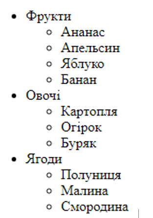

. Усім посиланням меню задати фіолетовий колір тексту через селектор тегу.
. Лише пунктам головного меню (посиланням) задати зелений колір тексту через селектор класу.
. Змінити тип маркера останнього (вкладеного) списку на квадрат (полуниця, малина, смородина) через селектор класу.
. Змінити тип маркера другого (вкладеного) списку на піктограму (картопля, огірок, буряк) через селектор класу.
. Прибрати маркери лише у вкладених списках через комбінатор нащадків трьох тегів.
. Для посилань, що знаходяться в останньому списку прибрати підкреслення через комбінатор нащадків класу та тегу.
. Додати до маркованого списку блок «Різне» із 4-ма елементами, де кожен елемент списку – це нумерований список із текстом-риба по 50 слів. Для даного блоку задати внутрішнє розташування маркерів/нумерації щодо тексту через селектор тегу.

*Результат 3-го завдання:*

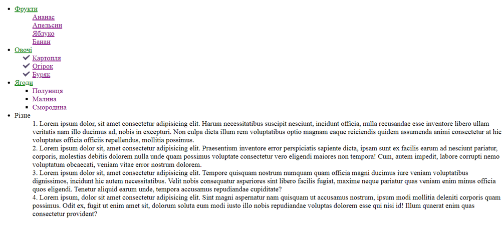

=== Завдання №4

Створити HTML-файл «lab4_4.html» та таблицю стилів «style.css». У файлі «lab4_4.html» підключити файл «style.css».

Скопіювати в «lab4_4.html» код наведений в файлі «materials/lab4_4.txt».

. Необхідно застосувати правила css (курсивність; жирність; підкреслення) лише для тегів span, що знаходяться в середині тегів p з класом .text-background, через комбінатор нащадків класу та тегу. Решта span повинні залишитись без змін.
. Необхідно застосувати правила css (колір фону – жовтий) лише для тегів span, що знаходяться в середині тегів з класом .text-background, які в свою чергу, знаходяться в тезі div, через комбінатор нащадків тегу, класу та тегу. Решта span повинні залишитись без змін.
. Необхідно застосувати правила css (колір фону – сірий; текст перекреслений) лише для тегів span, що знаходяться в середині інших span, через комбінатор нащадків двох тегів. Решта span повинні залишитись без змін.
. Необхідно застосувати правила css (розмір шрифту – 18px; усі символи тексту переведено у верхній регістр) лише для тегів span, що знаходяться в середині інших span, які в свою чергу, знаходяться в нумерованому списку, через комбінатор нащадків трьох тегів. Решта span повинні залишитись без змін.
. Необхідно застосувати правила css (тінь до тексту: горизонтальне зміщення 3px, вертикальне зміщення 3px, розмиття тіні 5px, колір тіні – на вибір студента; величина відступу першого рядка – 50px) лише для тих абзаців, які розташовані в тезі section тільки на першому рівні вкладеності, через комбінатор дочірнього елементу двох тегів. Решта абзаців тексту повинні залишитись без змін.
. Необхідно застосувати правила css (замінити маркер списку на зображення) лише для елементів ul, які розташовані безпосередньо в li, через комбінатор дочірнього елементу двох тегів. Решта маркерів списку повинні залишитись без змін.
. Необхідно застосувати правила css (інтервал між словами – 50px) лише для тих абзаців з класом .text-background, що знаходяться на першому рівні вкладеності в тезі div, через комбінатор дочірнього елементу тегу та класу. Решта абзаців повинні залишитись без змін.
. Необхідно застосувати правила css (жирність) лише для тих абзаців, що знаходяться на першому рівні вкладеності в тезі div з класом .text-bold, через комбінатор дочірнього елементу класу та тегу. Решта абзаців повинні залишитись без змін.
. Необхідно застосувати правила css (міжрядковий інтервал тексту – 45px) лише для тих абзаців, що знаходяться на першому рівні вкладеності в тезі section, який є прямим нащадком тегу div з класом .text-bold, через комбінатор дочірнього елементу класу та двох тегів. Решта абзаців повинні залишитись без змін.
. Необхідно застосувати правила css (колір фону – коричневий) лише для тих абзаців, які розташовані відразу ж за елементом img, не торкаючись інших абзаців (крім того, p та img є сусідами-сиблінгами один до одного), через комбінатор наступного сусіднього елемента одного рівня двох тегів.
. Необхідно застосувати правила css (колір тексту – червоний) лише для тих абзаців, які розташовані після елемента section на тому ж рівні вкладеності, через комбінатор всіх сусідніх елементів одного рівня двох тегів

*Результат 4-го завдання:*

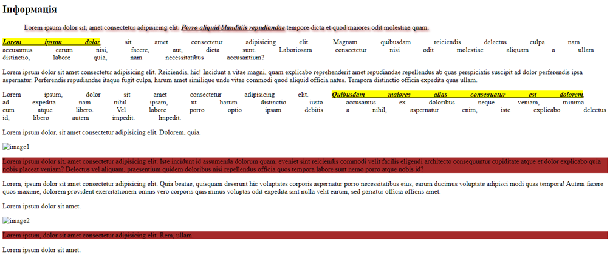
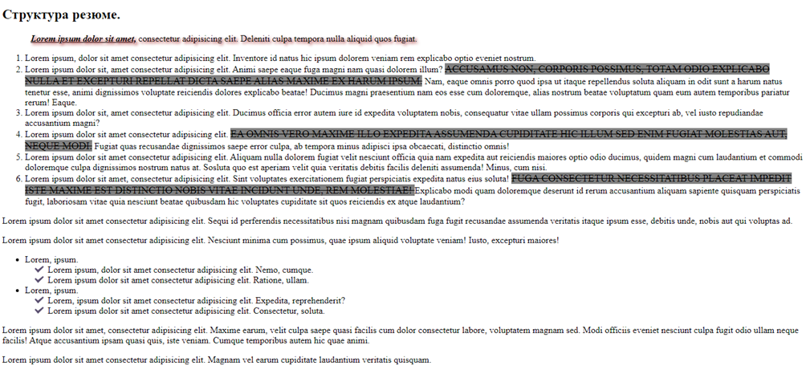
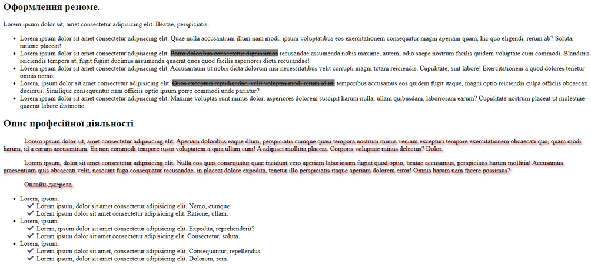
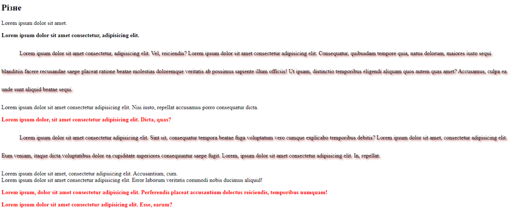

== Контрольні запитання:

. ЯкаCSS-властивість використовується для зміни типу шрифту елемента?
. Як за допомогою CSS змінити розмір шрифту?
. Для чого використовується властивість font-weight?
. Яке значення властивості font-style задає курсивне написання тексту?
. Як користатися скороченим записом властивості font? Наведи приклад.
. Якою властивістю можна задати відстань між літерами у тексті?
. Яка різниця між властивостями text-align та vertical-align?
. Як за допомогою CSS зробити текст підкресленим або перекресленим?
. Що робить властивість text-transform і які вона має основні значення?
. Як можна задати міжрядковий інтервал у тексті?
. Що робить властивість text-shadow і як виглядає її синтаксис?
. Як за допомогою селекторів застосувати стиль лише до певного елемента з конкретним класом?
. У чому різниця між селекторами класу (.class) і ідентифікатора (#id)?
. Як вибрати всі елементи 
, які знаходяться всередині елемента з класом .content?
. Який пріоритет мають різні типи селекторів у CSS (тег, клас, id, inline-стиль)?
