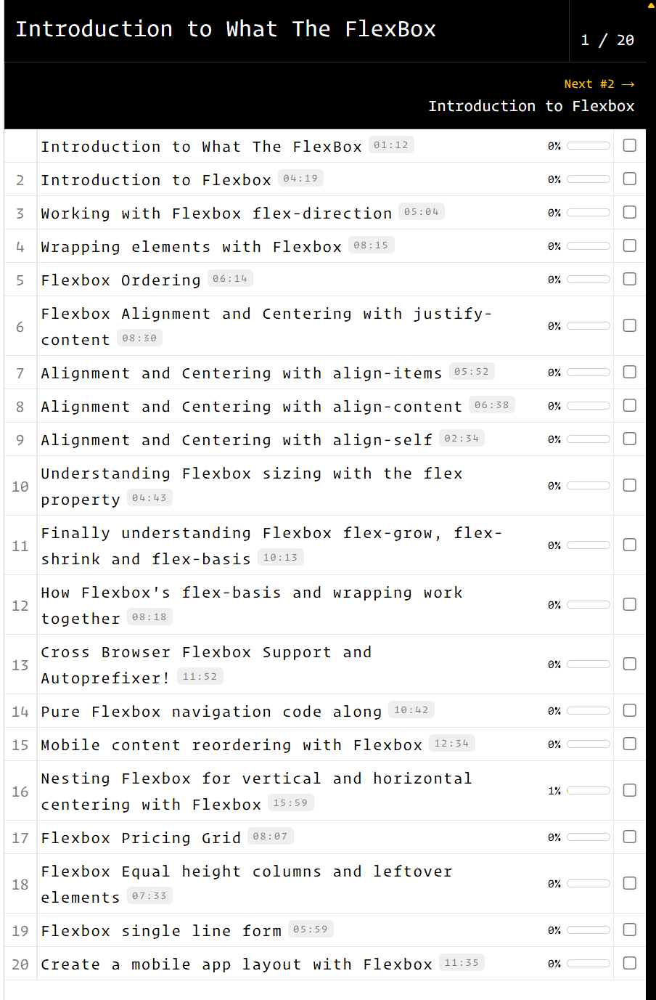
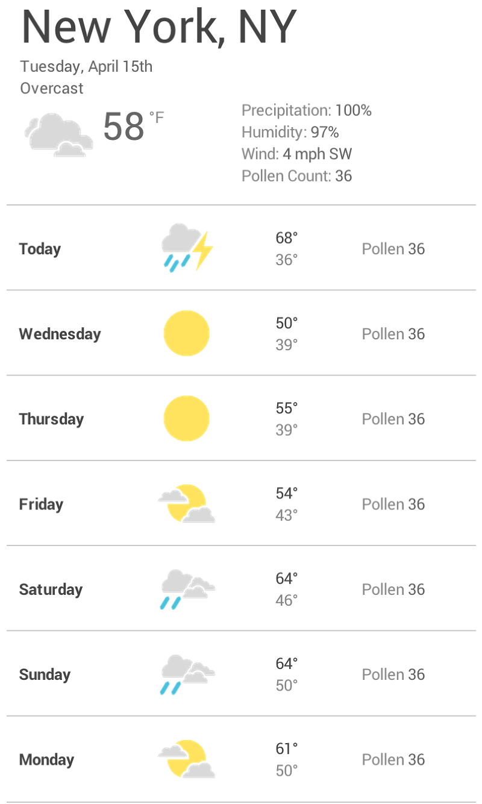
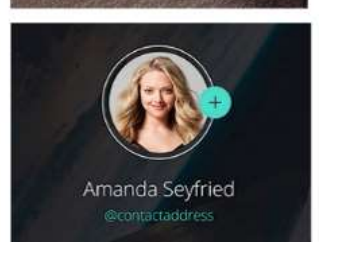
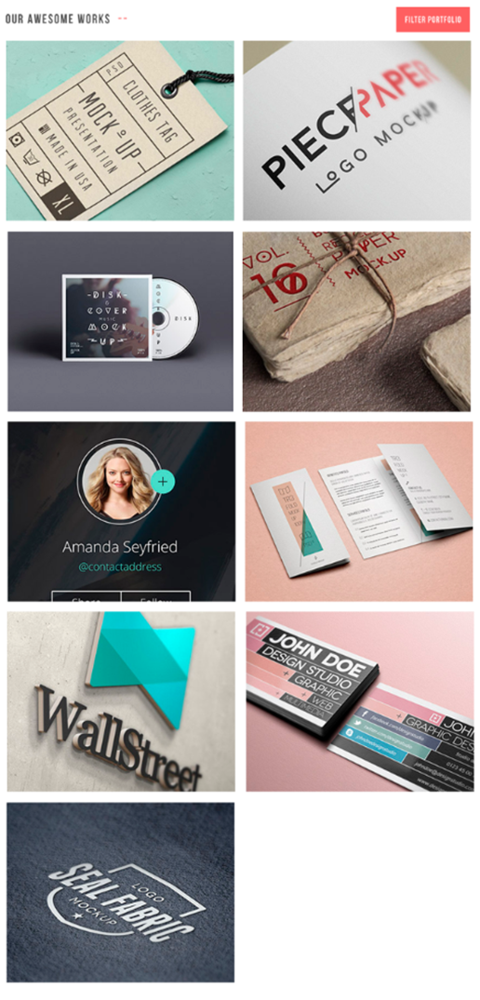
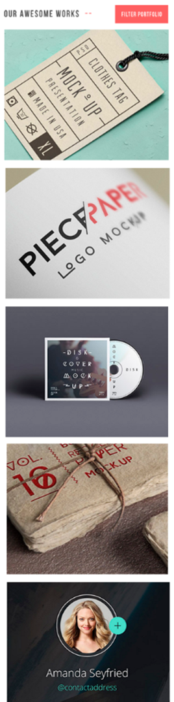
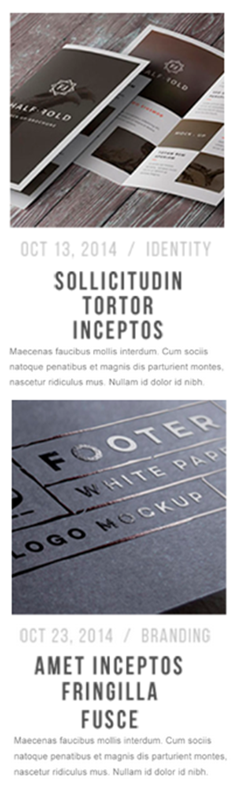
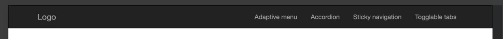
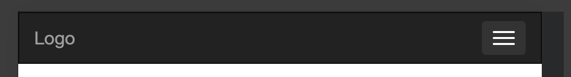
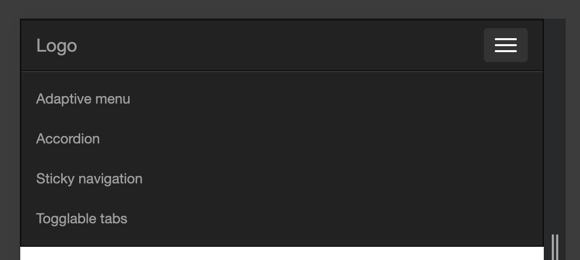

= ЛАБОРАТОРНА РОБОТА №8

*Тема: Робота з Flexbox в CSS. Основи адаптивної верстки: використання media-запитів.*

*Мета: Ознайомитися з принципами роботи моделі розташування елементів Flexbox у CSS, навчитися створювати гнучкі та зручні у використанні макети вебсторінок. Закріпити навички побудови адаптивної верстки за допомогою media-запитів, що забезпечують коректне відображення інтерфейсу на пристроях із різною роздільною здатністю екрана*

*Вимоги до звіту:*

. Для всіх завдань використовувати скидання стилів (reset або normalize).
. Додати шрифти до завдань з https://fonts.google.com/[Google Fonts].
. Використати https://developer.mozilla.org/en-US/docs/Web/CSS/var[CSS variables]
. Дотримуватись правил написання html, css.
. Заборонено використання сторонніх UI бібліотек.
. Результати завдань лабораторної роботи повинні бути завантажені до особистого репозиторію студента.

== Самостійна робота:

** https://developer.mozilla.org/en-US/docs/Web/CSS/CSS_flexible_box_layout/Basic_concepts_of_flexbox[Basic concepts of flexbox]
** https://css-tricks.com/snippets/css/a-guide-to-flexbox/[CSS Flexbox Layout Guide]
** https://developer.mozilla.org/en-US/docs/Web/CSS/CSS_media_queries/Using_media_queries[Using media queries]
** https://css-tricks.com/a-complete-guide-to-css-media-queries/[CSS Media Queries Guide]
** https://blog.ithillel.ua/articles/the-complete-guide-to-flexbox[Повний посібник з Flexbox + Using media queries]

== Практична частина

=== Завдання 1

Пройти інтерактивну гру https://flexboxfroggy.com/[Flexbox Froggy]. Результат виконання додати у вигляді print screen у репозиторії.

=== Завдання 2

Зареєструватися та пройти курс https://flexbox.io[What The Flexbox?!]. Результат з прогресом виконання додати у вигляді print screen у репозиторії. Повторити код усіх уроків та представити у репозиторії.

=== Завдання 3

Відтворити приклад макета додатків погоди на n-кількість днів, на базі гнучкої FLEX
розмітки (використавши різні іконки з директорії *icons*).

=== Завдання 4

Семантична верстка вебсторінки з *фіксованими* розмірами згідно макету на базі гнучкої FLEX розмітки, використовуючи довільні зображення та довільний контент.

image::task-8_2.png[]

До всіх інтерактивних елементів додати CSS-псевдокласи стану елементів: :hover, :focus та :active (кнопки та гіперпосилання).

Приклад стану картки: :hover

Передбачити переповнення контенту для блоків з текстом.

=== Завдання 5

Зверстаний макет доповнити механізмами адаптивності з використання media-запитів:

* Секція «Our awesome works»

Якщо ширина сторінки досягає позначки 768рх або менше, розставити всі блоки
секції у два стовпці.

Якщо ширина сторінки досягає позначки 576рх або менше, розставити всі блоки
секції один над іншим (тобто в один стовпець).

* Секція «What do we do»

Якщо ширина сторінки досягає позначки 768рх або менше, розставити всі блоки
секції в два стовпці.

Якщо ширина сторінки досягає позначки 576рх або менше, розставити всі блоки
секції один над іншим (тобто в один стовпець).

* Секція «From the journal»:

Якщо ширина сторінки досягає позначки 768рх або менше, розставити всі блоки
секції один над іншим (тобто в один стовпець).

Якщо ширина сторінки досягає позначки 576рх або менше, розставити всі блоки
секції наступним чином:

* Розробка адаптивного berger menu з використанням HTML, CSS, якщо ширина сторінки досягає
позначки 768рх або менше:

Блок «header» необхідно зафіксувати, щоби при скролінгу вона завжди залишалась
зверху.

Піктограму «бургер» необхідно промальовувати (три смуги) через псевдо-елементи
::before та ::after, а не використовувати рисунок.

Приклад вигляду меню:

По кліку на berger menu повинно відкриватись та закриватись.

=== Завдання 6

Кінцевий результат роботи створення адаптивної вебсторінки представити на https://docs.github.com/en/pages[GitHub Pages]
