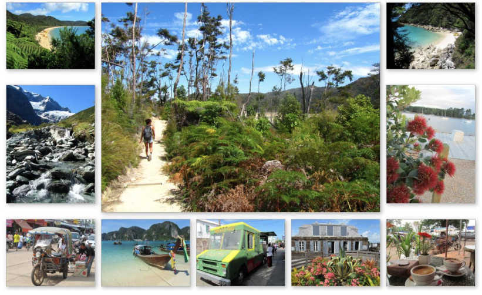
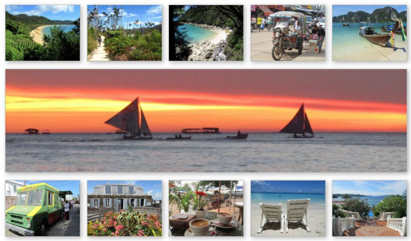
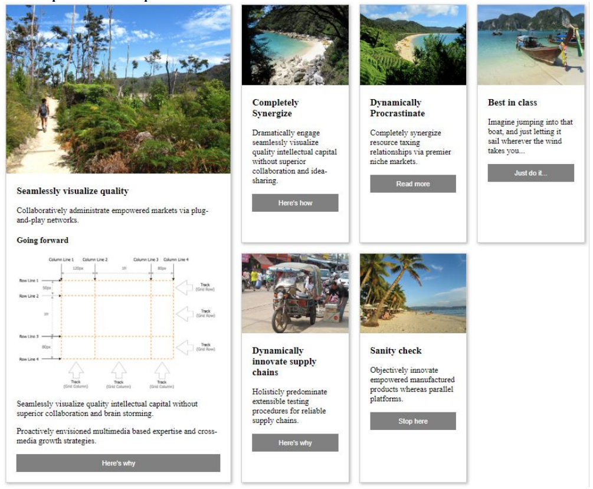
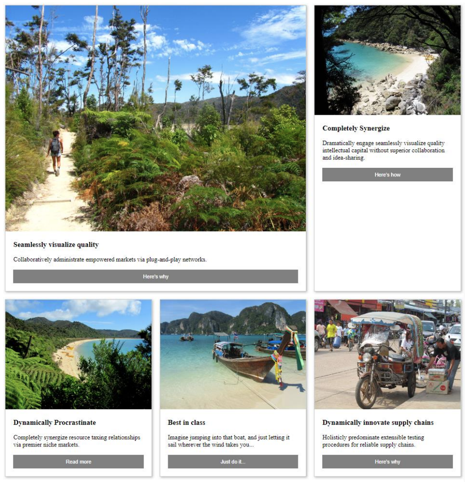
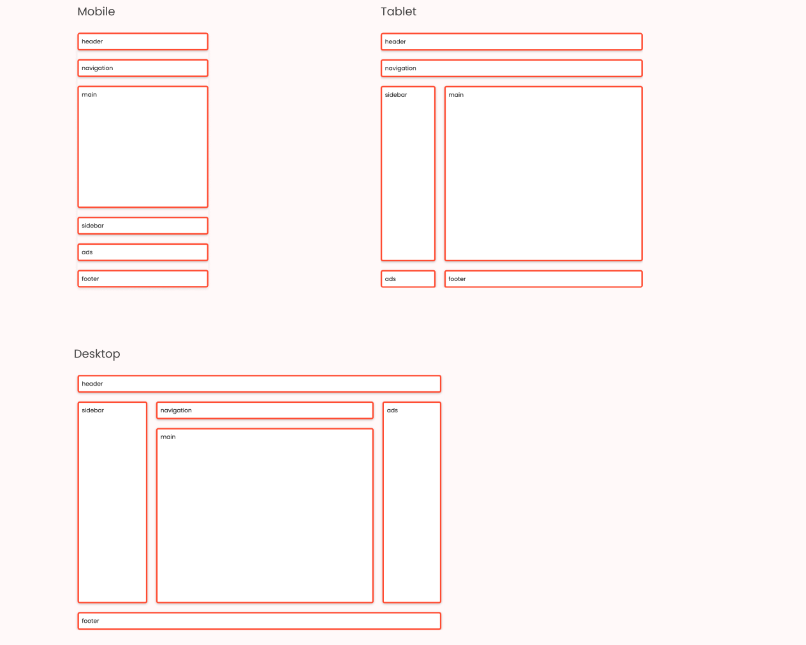
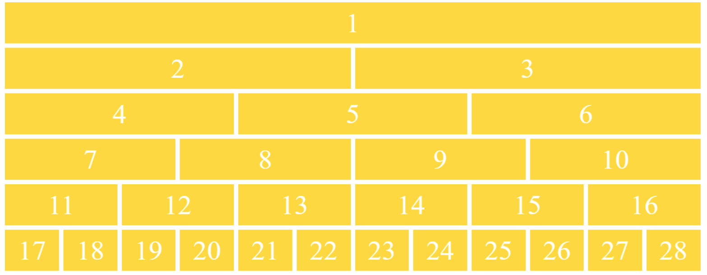
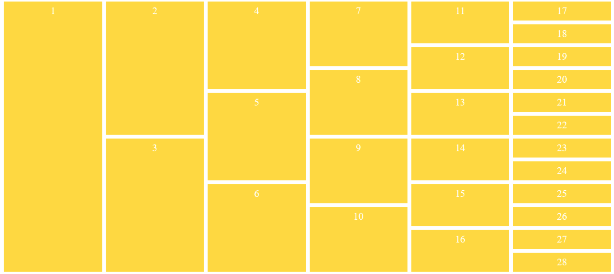

= ЛАБОРАТОРНА РОБОТА №9

*Тема: Основи CSS Grid Layout*

*Мета: Ознайомитися з принципами роботи CSS Grid Layout, навчитися створювати двовимірні сітки для розташування елементів на вебсторінці. Закріпити навички побудови адаптивних макетів із використанням властивостей grid-контейнера та grid-елементів, що забезпечують зручне та гнучке керування структурою сторінки.*

*Вимоги до звіту:*

. Для всіх завдань використовувати скидання стилів (reset або normalize).
. Використати https://developer.mozilla.org/en-US/docs/Web/CSS/var[CSS variables].
. Дотримуватись правил написання html, css.
. Заборонено використання сторонніх UI бібліотек.
. Результати завдань лабораторної роботи повинні бути завантажені до особистого репозиторію студента.

== Самостійна робота:

** https://developer.mozilla.org/en-US/docs/Web/CSS/CSS_grid_layout[CSS grid layout]
** https://css-tricks.com/snippets/css/complete-guide-grid/[CSS Grid Layout Guide]
** https://web.dev/learn/css/grid[Grid]
** https://gridbyexample.com/learn/[Everything you need to learn CSS Grid Layout]

== Практична частина

=== Завдання 1

Пройти інтерактивну гру https://cssgridgarden.com/[Css Grid Garden]. Результат виконання додати у вигляді print screen у репозиторії.

=== Завдання 2

Зареєструватися та пройти курс https://cssgrid.io/[Css Grid]. Результат з прогресом виконання додати у вигляді print screen у репозиторії. Повторити код усіх уроків та представити у репозиторії.

=== Завдання 3

З використанням CSS grid layout реалізувати сторінку з галерею фотографій. Макети сторінок обираються відповідно до номера у списку підгрупи. Фото на вибір студента.
Продумати адаптивність сторінок використанням media-запитів для ширин 768рх та 576рх.

Для парних номерів:

Для не парних номерів:

=== Завдання 4

З використанням CSS grid layout реалізувати сторінку з картками. Макети сторінок обираються відповідно до номера у списку підгрупи. Фото на вибір студента. Передбачити переповнення контенту картки.
Продумати адаптивність сторінок використанням media-запитів для ширин 768рх та 576рх.

Для парних номерів:

Для не парних номерів:

=== Завдання 5

З використанням CSS grid layout реалізувати адаптивний layout сторінки використовуючи підхід mobile-first.
Дане завдання необхідно реалізувати двома способами: з column grids + rows та grid-template-areas.

=== Завдання 6

З використанням CSS grid layout реалізувати деревовидну структуру блоків. Макети сторінок обираються відповідно до номера у списку підгрупи. Нумерацію блоків реалізувати через генерований вміст (generated content).

Для парних номерів:

Для не парних номерів:

