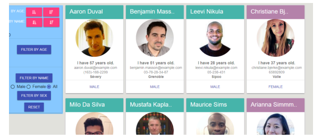

= ЛАБОРАТОРНА РОБОТА №10

*Тема: Робота з Fetch API, URL API, History API.*

*Мета:* створити адаптивну сторінку пошуку друзів у соціальних мережах з картками користувачів, пошуком, сортуванням та фільтрацією.
Набути практичних навичок роботи з Fetch API, URL API, History API.

== Самостійна робота:

** https://randomuser.me/[API для отримання даних користувачів]
** https://randomuser.me/documentation[Documentation for the Random User Generator API]
** https://uk.javascript.info/network[Network requests]
** https://developer.mozilla.org/en-US/docs/Web/API/URL[URL API]
** https://developer.mozilla.org/en-US/docs/Web/API/History_API[History API]
** https://uk.javascript.info/array-methods[Методи масивів]
** https://developer.mozilla.org/en-US/docs/Web/JavaScript/Reference/Global_Objects/Array[Array]
** https://uk.javascript.info/task/debounce[Декоратор debounce]
** https://uk.javascript.info/task/throttle[Дросельний (throttle) декоратор]
** https://www.freecodecamp.org/news/javascript-debounce-example/[Debounce – How to Delay a Function in JavaScript (JS ES6 Example)]

== Практична частина

Створіть невеличку сторінку пошуку друзів у соціальних мережах з картками користувачів, пошуком, сортуванням та фільтрацією їх за віком, прізвищем, ім'ям, або чим завгодно, за допомогою Random User API.

Це приблизний приклад вашого UI.
Ви повинні стилізувати свою програму так, як хочете.
Зробіть це особистим, красивим та адаптивним.

=== Технічні вимоги:

** Вебсторінка має працювати без перезавантаження (Виконати обробку стану сторінки JavaScript-методами, без переходу на інші HTML-сторінки).
** Під час заходу на сторінку, показати юзеру форму авторизації/реєстрації з л.р. 9. Зробити фейкову авторизацію юзера на сторінці, записавши його у LocalStorage (в реальності це мав би бути запит на сервер).
Logout очищає дані з LocalStorage і знову показує юзеру форму авторизації/реєстрації.
** Вивести список карток користувачів на сторінці (30 карток на сторінку), картки повинні бути гарно стилізовані з фотографією користувача, ім'ям, віком, номером телефону, можливо, з іншою інформацією користувача, яку ви бачите в інформаційній картці користувача;
** Реалізуйте пошук із застосуванням debounce: ввівши ім’я в поле пошуку, і одразу побачити фільтрацію на сторінці;
** Реалізуйте сортування: додайте можливість сортувати картки за іменем/віком, за алфавітом (A-Z/Z-A) та за датою реєстрації;
** Реалізуйте фільтрацію: додайте можливість фільтрувати друзів за віком, роком народження, іменами, місцем розташування та електронною поштою;
** Додайте стильні іконки та крутий дизайн з тінями, градієнтами.
** Створить гарний дизайн, який підходить для мобільних пристроїв (responsive/fluid/elastic тощо);
** Реалізуйте підтримку адресного рядка, що означає, що користувач повинен бачити стан фільтрів і сортування в URL;
** Додайте пагінацію;
** Додайте довантаження контенту при прокручуванні (скролу), при цьому сторінка пагінації має показувати активні сторінки (Наприклад 1, 3 та 3 і т.д.).
** Реалізуйте збереження обраних друзів у LocalStorage.
** Обов'язково виконайте обробку помилок при запиті, якщо виникне помилка - то повідомте про це юзеру.
** Використання css фреймворків - заборонено!
** Використання alert, confirm, prompt - заборонено!
** Використовуйте функціональний стиль програмування.
** Використовуйте тільки pure functions.
** Опублікуйте ваш application на https://docs.github.com/en/pages/getting-started-with-github-pages/what-is-github-pages[GitHub Pages]
** Адаптивність.

== Контрольні запитання:

. Що таке Fetch API?
. Які переваги має використання Fetch API порівняно з іншими методами зробити мережеві запити?
. Як ви виконуєте асинхронний мережевий запит за допомогою Fetch API?
. Що таке URL API, і яка його роль у веброзробці?
. Які основні методи доступу до URL API?
. Що таке History API й для чого він використовується в веброзробці?
. Як використовувати History API для зміни URL без перезавантаження сторінки?
. Які методи й події History API можуть бути корисними для покращення користувацького досвіду?

