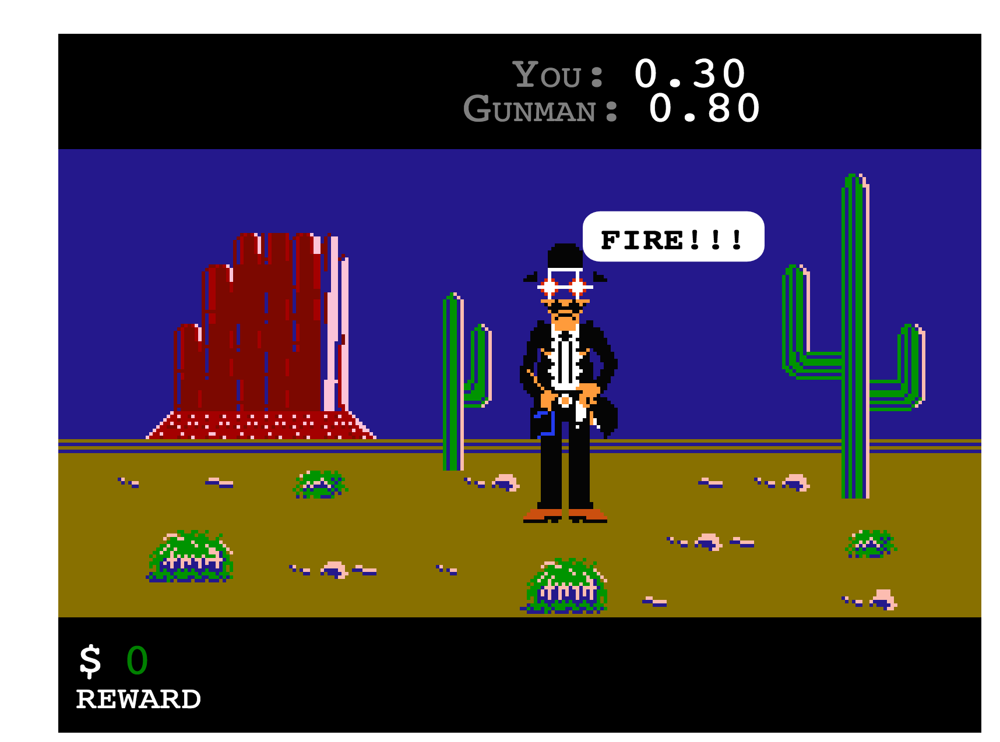

= ЛАБОРАТОРНА РОБОТА №7

*Тема: Маніпуляція з DOM.
Події браузера, їх властивості та шаблони обробки.
*

*Мета:* створення вебсторінок з використанням HTML, CSS та JavaScript для закріплення знань, які включають роботу з подіями, анімацією, динамічним додаванням контенту та стилей.
Кожне завдання спрямоване на розвиток навичок роботи з DOM (Document Object Model), подіями, анімацією, стилізацією та взаємодією користувача з вебсторінкою.

== Вимоги та самостійна робота:

** https://developer.mozilla.org/en-US/docs/Web/Events[Event reference]
** https://developer.mozilla.org/en-US/docs/Web/Events/Creating_and_triggering_events[Creating and triggering events]
** https://developer.mozilla.org/en-US/docs/Web/API/HTMLAudioElement/Audio[Audio() constructor]
** https://w3schoolsua.github.io/css/css_image_sprites.html#gsc.tab=0[CSS Спрайти зображень]
** https://developer.mozilla.org/en-US/docs/Web/CSS/@keyframes[CSS animation: keyframes]

== Практична частина

=== Необхідно створити гру Wild Gunman.

https://www.youtube.com/watch?v=ROmVSKZlRo0[Приклад геймплея оригіналу]

== Minimal functionality (4 бали)

** Починається гра.
** На центр екрана виходить персонаж і зупиняється
** Починається раунд (повідомлення Fire або інше)
** Користувач повинен клікнути мишкою саме в персонажа (дозволяється клікати в прямокутник, в якому зображення персонажа.
Клік захищається по всьому периметру прямокутника).
** Якщо користувач клікнув швидше ніж час X від початку стрільби, то він переміг, якщо ні - то він програв.
** У разі виграшу потрібно показати, що користувач переміг.
У разі програшу - що програв.
** Персонаж має змінювати свій вигляд залежно від того, чи він йде, стоїть, стріляє або програв дуель.

== Medium functionality (5 балів)

** Додати звуки в гру.
Фонову музику (sfx).
Повідомлення про статуси гри (типу Fire і т.д).
** Зміна музики в разі виграшу чи програшу.
** Додати кнопку перезапуску гри - після завершення раунду користувач натискає її й починається новий раунд.

== Advanced functionality (7 балів)

** Після закінчення раунду, якщо користувач виграв, починається новий.
Цього разу час N за який стріляє комп'ютерний персонаж зменшується (підвищується складність).
** Зробити, щоб у новому раунді був новий персонаж.
Можна зробити що б виходили рандомні персонажі з усіх що у вас будуть.
** За кожен раунд користувач буде заробляти очки (гроші).
З кожним рівнем кількість очок збільшується.
** Наприкінці гри необхідно показати скільки очок заробив користувач.

== Вимоги до завдання:

* Використовуйте функціональний стиль програмування.
* Використовуйте тільки pure functions.
* Опублікуйте гру на https://docs.github.com/en/pages/getting-started-with-github-pages/what-is-github-pages[GitHub Pages]

== Контрольні запитання:

. Що таке розмір і прокрутка елемента, і як це впливає на веброзробку?
. Як можна отримати розміри вікна та прокрутку сторінки у JavaScript?
. Які існують координатні системи у веброзробці, і як можна отримати координати елементів у відношенні до цих систем?
. Які можливості надає знання про розміри, прокрутку та координати для розробки користувацького інтерфейсу та взаємодії з користувачем на вебсторінці?
. Що таке події браузера і яка їх роль у веброзробці?
. Які основні типи подій існують у браузері?
. Що таке "бульбашковий механізм" у контексті подій браузера?
. Що таке делегування подій і як воно використовується для оптимізації обробки подій?
. Які типові дії браузера можуть викликати події?
. Як можна ініціювати користувацькі події у JavaScript?
