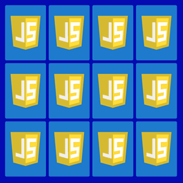
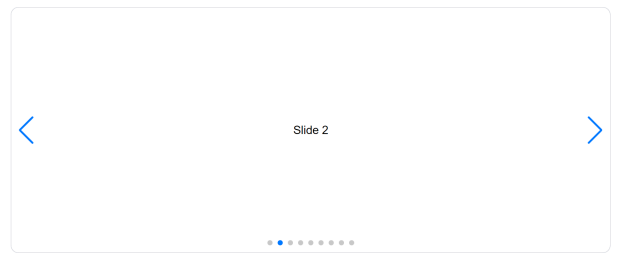
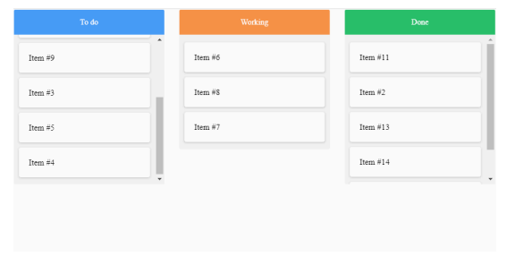

= ЛАБОРАТОРНА РОБОТА №8

*Тема: Маніпуляція з DOM.
Події інтерфейсу.*

*Мета:* закріпити практичні навички по роботі з DOM (Document Object Model) та подіями інтерфейсу у веб-розробці, створення веб-елементів.

== Вимоги та самостійна робота:

** https://css-tricks.com/snippets/javascript/shuffle-array/[Shuffle Array]
** https://www.w3schools.com/css/css3_transitions.asp[CSS3 Transitions]
** https://davidwalsh.name/css-flip[Create a CSS Flipping Animation ]
** https://uk.javascript.info/events[Вступ до подій]
** https://uk.javascript.info/event-details[Події інтерфейсу ]
** https://uk.javascript.info/task/carousel[Карусель example]
** https://www.w3schools.com/html/html5_draganddrop.asp[Drag and Drop Examples]
** https://developer.mozilla.org/en-US/docs/Web/API/HTML_Drag_and_Drop_API[HTML Drag and Drop API]

== Практична частина

=== Завдання 1 (5 балів).

=== Необхідно створити гру Memory Pair Game.

== Minimal functionality (1 бал)

** Відобразити набір з 12 карток (б.я. тематика), розкладених сорочками догори.
** Гравець відкриває по дві картки за хід (клік по картці).
** Якщо відкриті картки утворюють пару (однакові зображення або значення) — вони залишаються відкритими на полі.
** Якщо це не пара — картки перевертаються назад.
** Гра триває, доки всі пари не будуть знайдені.
** Додати кнопку "Рестарт", щоб почати гру заново.

== Medium functionality (3 бали)

** Додати блок "Налаштування гри" для вибору рівня складності та налаштування параметрів гри:
- Можливість обрати розмір ігрового поля (кількість рядків і стовпців).
Мінімальний розмір ігрового поля 4 x 4. Врахуйте, що необхідно буде заготовити відповідну кількість картинок.
- Вибір складності (easy, normal, hard) - пов'язаний з таймером зворотного відліку (наприклад. easy - 3 хв., normal - 2 хв., hard - 1 хв.).
Рівень до дефолту - easy.
** Додати кнопку "Скинути налаштування", щоб гравець міг скинути всі параметри налаштувань до дефолтних.
** Додати кнопку "Розпочати гру", щоб гравець міг почати гру з відповідними налаштуваннями.
** Відобразити таймер зворотного відліку, який починає відлік після початку гри.
** Відобразити кількість ходів та час, за яку гравцю вдалось закінчити гру.

== Advanced functionality (5 балів)

** Додати можливість обирати або грає 1 гравець або 2 гравці.
** Для кожного гравця можна задати ім'я.
** У налаштуваннях додати кількість раундів(по дефолту 1).
** Після n-раундів виводити ім'я переможця зі статистикою (кількість ходів та час) по кожному раунду.

== Вимоги до завдання 1:

* Використовуйте функціональний стиль програмування.
* Використовуйте тільки pure functions.
* Опублікуйте гру на https://docs.github.com/en/pages/getting-started-with-github-pages/what-is-github-pages[GitHub Pages]

=== Завдання 2 (1 бал).

Створити вебелемент слайдер (карусель), який дозволяє юзеру прокручувати контент (зображення, тексти, відео тощо) горизонтально за допомогою кнопок, стрілок.

== Base functionality:

** Прокрутка контенту з анімацією (переміщення контенту вперед або назад).
Якщо юзер дійшов до останнього слайду, перемістити знову на перший (continuous loop mode).
** Навігаційні елементи: кнопки у вигляді стрілок (slider-arrows), елементи керування (pagination, slider-dots), які дозволяють користувачам переміщатися між слайдами.
Зміна поточного елемента за допомогою клавіш ← та → (keyboard events).
** Анімація: анімаційні ефекти для плавного зміщення контенту.
** Реалізувати можливість ініціалізації слайдеру з параметрами конфігурації: масив картинок, швидкість анімації (duration of transition between slides (in ms)), автоматичне прокручування (autoplay), відображення slider-arrows, відображення pagination, slider-dots.
Передбачити дефолтні або необов'язкові параметри.
** Якщо ввімкнено автоматичне прокручування (autoplay) і курсор миші знаходиться на слайді, то зупиняти автоматичне прокручування, доти доки юзер не забере курсор миші.
** Адаптивність.

=== Завдання 3 (1 бал).

Створити вебсторінку для управління завданнями у форматі Kanban Board.
Самі завдання можна зробити статичними.
Головне реалізувати переміщення завдань з використанням HTML Drag and Drop API.
Дизайн на ваш розсуд.

== Контрольні запитання:

. Що таке події браузера і яке їх призначення?
. Що таке "бульбашковий механізм" у контексті подій браузера?
Як він працює?
. Як використовується делегування подій для ефективної обробки подій в браузері?
. Які типові дії браузера можна спостерігати при взаємодії з вебсторінкою?
. Як можна запустити користувацьку подію в браузері?
. Що таке події миші та які є типові приклади використання?
. В чому полягає різниця між подіями mouseover/out та mouseenter/leave?
. Як відбувається взаємодія з подіями миші при використанні Drag'n'Drop?
. Які події вказівника доступні в браузері?
Для чого вони використовуються?
. Що таке події клавіатури keydown та keyup і як вони відрізняються?
. Як відбувається обробка подій прокрутки сторінки у браузері?
