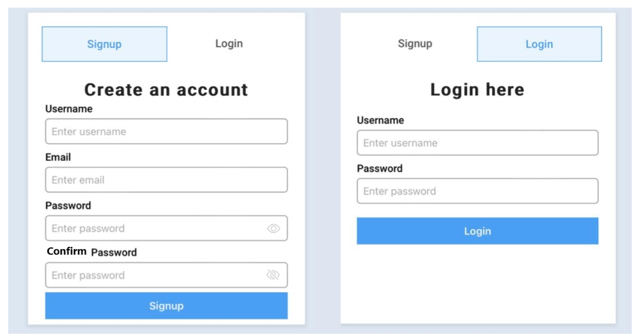
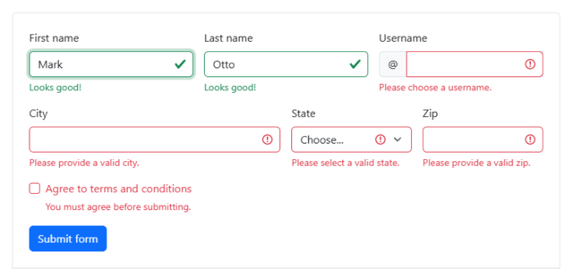

= ЛАБОРАТОРНА РОБОТА №9

*Тема: Робота з формами.*

*Мета:* навчитися обробляти форми, валідувати їх та відправляти без перезавантаження сторінки за допомогою JavaScript.

== Вимоги та самостійна робота:

** https://uk.javascript.info/form-elements[Властивості та методи форми]
** https://uk.javascript.info/formdata[FormData]
** https://developer.mozilla.org/en-US/docs/Learn/Forms/Form_validation#validating_forms_using_javascript[Validating forms using JavaScript]
** https://developer.mozilla.org/en-US/docs/Learn/Forms/Sending_forms_through_JavaScript[Sending forms through JavaScript]
** https://dev.to/nziokidennis/javascript-validation-39ka[JavaScript Validation]
** https://uk.javascript.info/regular-expressions[Регулярні вирази]
** https://developer.mozilla.org/en-US/docs/Web/JavaScript/Guide/Regular_expressions[Regular expressions]
** https://regex101.com/[Regular expression tester]

== Практична частина

Форми — основа вебу. Грубо кажучи, типовий застосунок здебільшого складається із форм та списків.

=== Форми повинні бути:

** зручними: користувач чітко розуміє, яку дію має зробити, чи що ввести. Якщо ввід користувача неправильний, це повинно бути повідомлено в зрозумілій формі. Поля вводу і форма повинні реагувати на дії користувача надаючи чітке розуміння, що відбувається, і що потрібно зробити (чи поле активне, сфокусоване, чи очікується введення даних тощо).
** доступними: користувач часто заповнює форму не на комп'ютері, а на мобільному пристрої, не за допомогою мишки, а за допомогою клавіатури замість неї, іноді з допомогою зчитувача екрану. Сучасні веб-застосунки повинні бути зручними в усіх перерахованих випадках.
** гарними і функціональними: стандартний вигляд полів вводу може сильно відрізнятися від дизайну застосунку. Їх стилізація деяких полів може бути доволі складна, оскільки потрібно повністю зберігати функціональність.

Необхідно реалізувати форму для авторизації користувачів та їх реєстрації, яка буде відображатися у вигляді табів на вебсторінці.

=== Форма реєстрації має наступні поля:
** First Name (обов'язкове, повинно бути менше 3-х та не більше 15-ти символів).
** Last Name (обов'язкове, повинно бути менше 3-х та не більше 15-ти символів).
** Email (обов'язкове, повинно бути валідно відповідно до шаблону мейлу ___@__.__ (реалізувати через regular expression).
** Password (обов'язкове, повинно бути не менше 6-ти символів).
** Confirm password (обов'язкове, повинно збігатися з полем Password). Поле Password  та Confirm password містить іконку у вигляді ока, клік по якій дозволяє користувачеві показати/приховати пароль який він вводить).
** Phone (обов'язкове поле, повинно бути валідно відповідно до шаблону мобільного оператору України +380....).
** Date Birth (обов'язкове полe, якщо користувачу менше 12 років, вивести відповідне повідомлення, що він не зможе зареєструватися, дата народження не може бути у майбутньому).
** Sex (male, female) (обов'язкове полe).
** Country (обов'язкове полe, випадаючий список країн).
** City (обов'язкове полe, випадаючий список міст відповідної країни. Поле не активне, поки поле Country не обране).

== Форма авторизації має наступні поля:

** Username (обов'язкове поле).
** Password (обов'язкове поле, повинно бути не менше 6-ти символів). Поле Password  містить іконку у вигляді ока, клік по якій дозволяє користувачеві показати/приховати пароль який він вводить).
** Remember Me (true, false) (не обовязкове поле, використовується для запамятовування сесії користувача).

=== Технічні вимоги:
** HTML, CSS, JavaScript.
** Адаптивність.
** Розробити привабливий та інтуїтивно зрозумілий дизайн форми.
** Використовувати яскраві та привабливі елементи дизайну для полегшення сприйняття користувачем.
** Обов'язкова валідація усіх полей форм з використанням JavaScript.
** Якщо поле валідне - додати йому зелений border, якщо не валідне - червоний. Показувати текстову помилку користувачеві. (див. рисунок для прикладу нижче).
** Обидві форми повинні валідуватися по сабміту форми.
** Сторінка під час відправлення даних не має перезавантажуватися;
** У разі успішного відправлення - показати користувачеві, що його успішно зареєстровано та очистити форму.

=== Приблизний вигляд форми й помилок

== Контрольні запитання:

Що таке властивість "action" форми? Як вона використовується?

. Яка роль властивості "method" в формі?
. Що таке метод "submit()" для форми і як його викликати?
. Як використовувати метод "reset()" для очищення значень в формі?
. Яка різниця між атрибутами й властивостями форми в JavaScript?
. Як можна перевірити введені дані в форму перед її відправленням?
. Як можна створити форму динамічно за допомогою JavaScript?
. Що таке об'єкт FormData в JavaScript?
. Які переваги має використання об'єкта FormData порівняно з традиційним методом отримання даних форми?
. Як додати дані до об'єкта FormData за допомогою JavaScript?
. Які методи доступні для роботи з об'єктом FormData?
. Як відправити дані з об'єктом FormData на сервер за допомогою AJAX-запиту?
. Як перебрати всі пари ключ-значення в об'єкті FormData?

